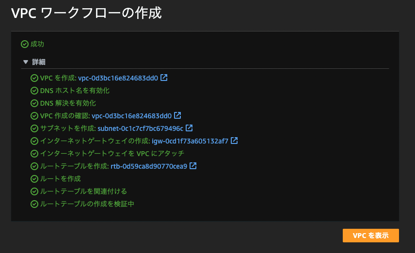

# AWSにEC2を構築する

## ユーザー

ルートユーザーとIAMユーザーがある

### ルートユーザー

* ルートユーザーはAWS作成時に自動的に作成される
* ルートユーザーは解約など何でもできる
* 実作業をするアカウントとしては推奨されない

### IAMユーザー

* 決められた権限の範囲のことだけをできるユーザー

## IAMユーザーを作る

* ルートユーザーでログインして、IAMを選択
* ポリシーを直接アタッチ
* 許可ポリシー：AdministratorAccessにチェック

## EC2インスタンス

* Amazon EC2で立ち上げたサーバー
* 仮想マシン / AzureでいうVMのこと

### VPC＆サブネットの作成

EC2インスタンスを配置するためのVPCとサブネットを作成する

* VPCページへ
* 作成するリソース：VPCなど
  * サブネット、ルートテーブル、インターネットゲートウェイ、VPCエンドポイントをVPCと同時に作成する
* 関連リソースの作成
  * VPC: vpc-001
  * サブネット：public-subnet-001
  * ルートテーブル：rtb-001
  * インターネットゲートウェイ：igw-001
  * VPCエンドポイント：vpc-endpoint-001
* IPv4 CIDRブロック：10.0.0.0/24
* サブネットのCIDRブロック：10.0.0.0/26
* AZの数：1
* VPCエンドポイント：なし
  * セキュリティの向上は不要のためなし

* VPC作成



* VPCにインターネットゲートウェイをアタッチする
* サブネット作成
* サブネットのルートテーブルに0.0.0.0/0がインターネットゲートウェイに接続するように編集する


### EC2インスタンスを作成する

* AWSコンソールでEC2のサービスページに行く
* 左メニューのインスタンスを選択
* インスタンスを起動を選択
  * 名前
  * AMI（Amazonマシンイメージ）を選ぶ
    * ここでは、"Amazon Linux 2 Kernel 5.10 AMI 2.0.20230727.0 x86_64 HVM gp2"を選択（無料枠の対象）
  * インスタンスタイプを選択
    * t2.microを選択（無料枠の対象）
  * キーペア
    * 新しいキーペアを作成
    * キーペア名：shimizu-ec2-001-accesskey
    * キーペアのタイプ：RSA
    * プライベートキーファイル形式：.pem
  * ネットワーク設定
    * 上で作成したVPC＆サブネットを指定する
      * vpc-001 / public-subnet-001
    * セキュリティグループを作成する
      * 名前：sg-001
    * 任意の場所からのSSHトラフィックを許可する
  * ストレージを設定
    * 8GiB gp2

#### キーペアに関する補足

* キーペアは作成時にダウンロードできる
  * 作成後にAWSコンソールからダウンロードすることはできない
  * キーペアを作成するときに自動的にダウンロードされている
* キーを紛失した場合
  * EC2インスタンスを作成し直す
  * SSM（AWS Systems Manager）でEC2に入って、キーを作り直す

#### ネットワークに関する補足

EC2インスタンスを作成するとき、デフォルトのVPCやサブネットが紐づく。
ただし、デフォルトのVPCは使わない運用が普通。
そのため、ちゃんと役割を明確にしたVPCやサブネットを作成するのが良い
（デフォルトのVPCを使ってしまうと、そのネットワーク領域に何のリソースが配置されるか分からなくなってしまうため基本NGとなっている）

## 作成したEC2インスタンスにSSHで接続する

* AWSコンソールで作成したEC2インスタンスの詳細画面に行く
* 接続 → SSHクライアント
* EC2インスタンス作成＆ダウンロードしたキーがある階層で下記を実行する

```
$ chmod 400 shimizu-ec2-001-accesskey.pem
$ ssh -i "shimizu-ec2-001-accesskey.pem" ec2-user@ec2-54-92-48-202.ap-northeast-1.compute.amazonaws.com

Are you sure you want to continue connecting (yes/no/[fingerprint])? yes
Warning: Permanently added 'ec2-54-65-139-185.ap-northeast-1.compute.amazonaws.com' (ED25519) to the list of known hosts.
Last login: Sun Aug  6 08:27:38 2023 from 133-32-134-161.east.xps.vectant.ne.jp

       __|  __|_  )
       _|  (     /   Amazon Linux 2 AMI
      ___|\___|___|

https://aws.amazon.com/amazon-linux-2/
2 package(s) needed for security, out of 2 available
Run "sudo yum update" to apply all updates.
```

"sudo yum update"を実行する
```
[ec2-user@ip- ~]$ sudo yum update
```

### SSH接続できなかった理由

* EC2作成のネットワーク設定で"パブリック IP の自動割り当て"が無効になって作成されていた。結果として、パブリックIPが設定されていなかった。

## ポート

どのアプリケーションが送受信をするのかを決めるための番号

### 前提

* 実際に通信によってデータをやり取りするのは、アプリケーション
* IPアドレスは、送受信先のコンピュータを特定するが、アプリケーションまでは特定できない。そこで「どのアプリケーションから送信されたか？やどのアプリケーション宛か？」を特定する仕組みが必要

### ウェルノウンポート

* サーバ側のアプリケーションが使用する事前に決められたポート番号
* ポート番号のうち、0~1023がウェルノウンポート

* 22: SSH
* 80: HTTP
* 443: HTTPS

## SSH

* サーバ等のコンピュータにリモートアクセスするためのプロトコル
* 通信内容は暗号化されるため、セキュア
  * 同じくリモートアクセスのための仕組みであるtelnetは通信が暗号化されない

### 認証の仕組み

* パスワードや公開鍵秘密鍵やワンタイムパスワードなどの認証方法を選択できる

## CIDR表記

IPアドレスのネットワーク部とホスト部の境目がどこかを示すための表記

### 例

* 10.0.0.1/24
  * 2進数表記で1〜24番目までがネットワーク部、25〜32番目がホスト部であることを意味する
  * ホスト部は8桁なので、このネットワークには256のホストが割り当てできる
    * ただし、10.0.0.0（2進数表記でホスト部が全て0）と10.0.0.255（2進数表記でホスト部が全て1）は割り当てられないため、254のホストに割り当て可能
      * 10.0.0.0は、そのネットワーク自体を示すIPアドレス（ネットワークアドレス）
      * 10.0.0.255は、ブロードキャストアドレス
* 192.168.8.1/23
  * 1〜23番目までがネットワーク部、24〜32番目がホスト部
  * 192.168.8.0 〜 192.168.9.255の510のホストに割り当て可能
    * 192.168.8.0がネットワークアドレス
    * 192.168.9.255がブロードキャストアドレス
